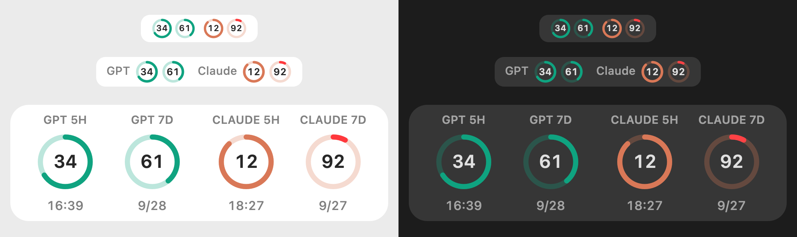

# QuotaBar

A tiny macOS meter for your **ChatGPT (Codex)** and **Claude** plan limits: four rings in the menu bar, or a thin floating strip.

[中文说明](#中文说明)



## Download

**[⬇ Download QuotaBar.zip](https://github.com/hera2019/QuotaBar/releases/latest/download/QuotaBar.zip)** · macOS 14 or later · Apple silicon and Intel

1. Unzip it and drag **QuotaBar.app** into **Applications**.
2. QuotaBar isn't notarized by Apple, so macOS blocks it the first time. Pick one way to allow it:
   - Open Terminal and run:
     ```bash
     xattr -dr com.apple.quarantine /Applications/QuotaBar.app
     ```
   - Or double-click it once, then go to **System Settings → Privacy & Security** and click **Open Anyway**.
3. Open QuotaBar. The rings show up in the menu bar (no Dock icon). Click them for details.

The app is in English, or Chinese (Simplified or Traditional) when that's your system language.

## Reading the rings

| | |
|---|---|
| Order | GPT 5H · GPT 7D · Claude 5H · Claude 7D |
| Color | Green track = GPT, orange track = Claude |
| Number | Percent **used** by default. Choose **Percentages → Remaining** in the menu to show what's left instead. Your choice is saved. |
| Arc | What's **left**. Turns red below 15% |
| `–` | Your plan doesn't have this limit (e.g. ChatGPT Plus shows only a weekly Codex limit) |
| `!` | Couldn't read the data. Open the menu to see why |

Click the menu bar icon, or right-click a floating window, to:
- see exact percentages and reset times
- switch **Display**: Menu Bar, Thin Strip (a 26-pixel bar you can park next to window title bars), or Card
- switch **Percentages** between Used and Remaining (for the ring numbers, menu details, and tooltips)
- refresh (⌘R) or quit

Floating windows can be dragged anywhere, and each style remembers its own position.

## Setting up the data

### GPT (Codex)

Nothing to set up if the **ChatGPT desktop app** is installed and signed in. QuotaBar runs its bundled `codex` tool and asks for your account's Codex rate limits every 3 minutes. It supports the newer `Contents/Resources/codex-cli/bin/codex` location as well as the older `Contents/Resources/codex` location. It also finds a standalone `codex` CLI in `/opt/homebrew/bin`, `/usr/local/bin`, or `~/.local/bin`.

### Claude

Claude doesn't expose plan usage to other apps, so **Claude writes it for QuotaBar**. Add this rule to `~/.claude/CLAUDE.md` (create the file if it doesn't exist):

```markdown
## QuotaBar usage sync
After finishing a piece of work and before reporting back:
1. Call `mcp__ccd_session_mgmt__get_usage` (if it's a deferred tool, load it with ToolSearch first).
2. Write the result to `~/Library/Application Support/QuotaWindow/claude-usage.json` (create the folder if needed):
   {"schema":1,"updatedAt":"<now, UTC>","windows":{
     "fiveHour":{"usedPercent":<percentUsed of "5-hour limit">,"resetsAt":"<its resetsAt>","durationMinutes":300},
     "weekly":{"usedPercent":<percentUsed of "Weekly · all models">,"resetsAt":"<its resetsAt>","durationMinutes":10080}}}
   Use ISO 8601 UTC times without milliseconds, e.g. 2026-09-27T10:59:59Z.
3. If usage can't be read, skip this step. Never let it interrupt the work.
```

- The usage tool only exists in the **Claude desktop app** (Code tab). Sessions elsewhere just skip the step.
- New sessions pick up the rule immediately. Already-open sessions need to be asked to re-read `CLAUDE.md`.
- The Claude rings update whenever Claude reports back. If the numbers look old, ask any Claude session to check usage.
- The `QuotaWindow` folder name is kept so QuotaBar can share the file with an earlier app that used it.

## Privacy

Everything stays on your Mac. QuotaBar makes no network requests itself. It reads one local file and asks your own signed-in `codex` for your own limits.

## Build from source

Requires Xcode (or the Swift toolchain) on macOS 14+.

```bash
./build.sh
```

This produces `build/QuotaBar.app` (universal) and `build/QuotaBar.zip`.

---

## 中文说明

一个很小的 macOS 用量监看：把 **ChatGPT（Codex）** 和 **Claude** 的 5 小时和 7 天额度画成四个圆圈，放在菜单栏里，或者放在一条细细的浮窗上。

### 下载与安装

**[⬇ 下载 QuotaBar.zip](https://github.com/hera2019/QuotaBar/releases/latest/download/QuotaBar.zip)** · macOS 14 以上 · Apple 芯片和 Intel 都能用

1. 解压后，把 **QuotaBar.app** 拖到"应用程序"文件夹。
2. 这个 App 没有经过 Apple 公证，第一次打开时 macOS 会阻止它。下面两种方法任选一种：
   - 打开"终端"，执行：
     ```bash
     xattr -dr com.apple.quarantine /Applications/QuotaBar.app
     ```
   - 或者先双击一次，再到 **系统设置 → 隐私与安全性**，点 **仍要打开**。
3. 打开 QuotaBar 后，圆圈会出现在屏幕最上方的菜单栏（没有 Dock 图标），点一下就能看详细信息。

系统语言是中文时，界面自动显示中文（简体或繁体）；其他语言显示英文。

### 怎么看

- 顺序：GPT 5H、GPT 7D、Claude 5H、Claude 7D。**绿色底圈是 GPT，橙色底圈是 Claude。**
- 中间的数字默认是**已用**百分比，比如 `92` 就是已用 92%。可在菜单的 **百分比显示 → 剩余** 中改为显示剩余百分比；选择会被记住。
- 弧线表示**剩余**额度，剩下不到 15% 时变红。
- `–`：你的方案没有这项额度（比如 ChatGPT Plus 只有 Codex 的 7 天额度）。
- `!`：读取失败，打开菜单可以看到原因。

点一下菜单栏的圆圈，或者右键点浮窗，可以：
- 查看每项的精确百分比和重置时间
- 切换**显示形式**：菜单栏、细条浮窗（高 26 像素，可以放在各程序标题栏那一带），或标准浮窗
- 切换**百分比显示**：已用或剩余；圆圈数字、菜单明细和悬停提示会一起更新
- 立即刷新（⌘R），或退出

浮窗可以拖到任何位置，每种形式各自记住自己的位置。

### 数据来源

**GPT**：安装并登录 **ChatGPT 桌面版** 就行，不用另外设置。QuotaBar 每 3 分钟通过桌面版自带的 `codex` 查询一次；兼容新版的 `Contents/Resources/codex-cli/bin/codex` 和旧版的 `Contents/Resources/codex`。

**Claude**：Claude 不会把用量提供给其他程序，所以要**请 Claude 自己写给 QuotaBar**。把下面这段加进 `~/.claude/CLAUDE.md`（文件不存在就新建一个）：

```markdown
## QuotaBar 用量同步
每做完一段工作、向我回报之前：
1. 调用 `mcp__ccd_session_mgmt__get_usage` 查一次用量（若它是延迟加载的工具，先用 ToolSearch 加载）。
2. 把结果写入 `~/Library/Application Support/QuotaWindow/claude-usage.json`（目录不存在就先建），格式：
   {"schema":1,"updatedAt":"<当前UTC时间>","windows":{
     "fiveHour":{"usedPercent":<"5-hour limit" 的 percentUsed>,"resetsAt":"<它的 resetsAt>","durationMinutes":300},
     "weekly":{"usedPercent":<"Weekly · all models" 的 percentUsed>,"resetsAt":"<它的 resetsAt>","durationMinutes":10080}}}
   时间一律用 ISO8601 且去掉毫秒，例如 2026-09-27T10:59:59Z。
3. 查不到用量就跳过这一步，不要因此中断或拖慢工作。
```

- 查用量的工具只有 **Claude 桌面 App**（Code 分页）里才有，在其他地方运行时会自动跳过这一步。
- 新开的会话立刻生效；已经开着的会话，要跟它说一声"重新读一下 CLAUDE.md"。
- Claude 每次回报时都会更新一次圆圈。数字看起来太旧的话，随便请一个 Claude 会话查一下用量就行。

### 隐私

所有资料都留在你的 Mac 上。QuotaBar 自己不连网，只读取一个本机文件，再向你已登录的 `codex` 查询你自己的额度。

### 自己编译

需要 macOS 14 以上，并安装 Xcode（或 Swift 工具链）。执行 `./build.sh`，会生成 `build/QuotaBar.app` 和 `build/QuotaBar.zip`。

## License

MIT
